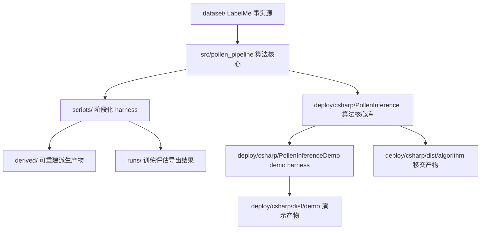

# Harness 架构说明

## 核心定义

本项目中的 harness 不是单独某个测试框架，而是一种工程组织方式：把稳定算法核心与具体运行场景隔离开来。核心算法只关心“给定输入，产生可解释输出”；harness 负责准备数据、设置参数、调用核心、记录产物、评估结果、可视化和打包交付。

当前项目的目标是花粉多焦距融合图上的检测与二级分类：

- YOLO26s 只负责花粉目标检出和后续计数框定位。
- 输入图像是显微镜多焦距图经融合算法得到的三通道融合图。
- 数据集只维护 LabelMe JSON，多类别标注是事实源。
- 单类别训练通过训练时参数在内存中合并为 `pollen`，不把单类别 YOLO 标签写回磁盘。
- 二级分类训练只使用检测权重推理后的离线 crop，不在分类 dataloader 中反复调用检测模型。
- 部署只保留 OpenVINO 路线，导出链路为 `pt -> onnx -> OpenVINO FP16`。

## 分层结构

### 事实源层

`dataset/` 是唯一人工维护的数据事实源。它保存原始多焦距组图、融合图、LabelMe JSON、类别顺序和训练验证划分。YOLO txt、`annotations*.jsonl`、检测预测、分类 crop、预标注结果都不属于事实源。

### 算法核心层

`src/pollen_pipeline/` 承载 Python 侧可复用能力：

- LabelMe 读取和 rectangle/polygon/mask 转框。
- YOLO26 检测训练适配器。
- 检测推理、离线 crop、分类训练、分类评估。
- 检测评估、pipeline 评估、pipeline 可视化。
- OpenVINO 导出和 metadata 写入。

`deploy/csharp/PollenInference/` 承载 C# 部署核心：

- OpenVINO 推理初始化。
- 检测模型推理和后处理。
- 检测框 crop 到分类输入。
- 分类模型推理。
- 对外提供可移交的算法调用接口。

算法核心不应该承担“选择哪个训练 run”“写哪个实验目录”“弹窗浏览图片”等场景化工作。

### Harness 层

Harness 是调用核心算法的外壳，当前包括：

- `scripts/00-02`：数据集阶段 harness。
- `scripts/10-12`：训练阶段 harness。
- `scripts/20-23`：评估与可视化 harness。
- `scripts/30-31`：导出和 C# 打包 harness。
- `scripts/90_smoke_cpu.ps1`：本地快速验证 harness。
- `deploy/csharp/PollenInferenceDemo/`：人工查看、调试和演示 harness。

Harness 可以读取环境变量、设置默认参数、选择运行目录、写产物和输出报告。Harness 不应该复制算法逻辑，复杂逻辑应下沉到 `src/pollen_pipeline/` 或 `PollenInference/`。

### 产物层

产物按可重建性分离：

- `derived/`：由事实源和模型可重建的中间产物，例如检测预测清单、分类 crop、预标注 JSON。
- `runs/`：训练、评估、可视化、导出结果。
- `deploy/csharp/dist/`：C# 打包产物。
- `archive/`：退出主流程的旧脚本、旧标签、旧实验和临时方案。

## 关键边界

| 边界 | 规则 |
| --- | --- |
| 数据集 | `dataset/` 只保存 LabelMe JSON、图像、类别和划分，不保存 YOLO txt 或 jsonl 派生标签。 |
| 类别模式 | `class_mode=single` 只在读取时内存合并为 `pollen`；`class_mode=multi` 保留 `classes.yaml` 顺序。 |
| 分类 crop | 只由检测权重一次推理并离线裁剪生成，分类训练不在线调用检测模型。 |
| 预标注 | 粗检测 + SAM2 结果只写入 `derived/prelabels/`，人工复核后再合并进 `dataset/`。 |
| 评估可视化 | 检测评估 overlay 用融合图绘制；GT 绿框，TP 蓝框，FP 红框，FN 通过只有绿框体现。 |
| 部署 | C# 部署只走 OpenVINO，模型类别、输入尺寸、预处理信息优先从 XML metadata 读取。 |
| demo | demo 是 harness，只负责选择模型、浏览图片、显示结果，不承载核心算法决策。 |

## 扩展原则

新增能力时先判断它属于哪一层：

- 会影响 LabelMe、类别、划分或人工事实源的，归入数据集层并更新 `dataset/` 契约。
- 会被训练、评估、导出、部署复用的，归入算法核心层。
- 只负责一次运行、默认参数、产物目录和用户入口的，归入 harness 层。
- 只用于审计、回溯和可视化的输出，归入 `derived/` 或 `runs/`。

如果一个功能同时包含核心逻辑和入口逻辑，应拆成“核心函数/模块 + harness 脚本”两部分。
