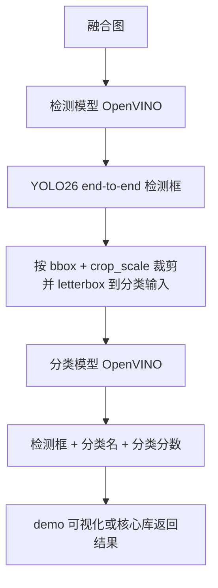

# 部署 Harness 与 C# 边界

## 当前部署路线

部署只保留 OpenVINO：

```text
PyTorch .pt -> ONNX 中间产物 -> OpenVINO FP32/FP16/INT8 model.xml/model.bin -> C# OpenVINO 推理
```

ONNX 只作为导出中间格式，不作为 C# demo 或算法核心的运行后端。当前生产路线固定为 YOLO26s 检测器 OpenVINO FP32 + 内部 NMS，ResNet34 分类器 OpenVINO INT8 PTQ。

## 模型 metadata 契约

导出脚本应尽量把部署所需信息写入 OpenVINO XML runtime metadata：

- `task`：`pollen_detector`、`pollen_classifier` 或 `pollen_classifier_int8_ptq`。
- `input_width` / `input_height`。
- `input_name` / `output_name`。
- `class_names`。
- `preprocessing`，例如分类 crop 的 `crop_scale`。
- `precision`：检测器生产路线为 `fp32`，分类器生产路线为 `int8`。

C# 运行时优先读取 XML metadata。只有 metadata 缺失时，才使用 `assets/classes.txt` 等兜底文件。交付目标是模型文件自描述，减少第三方配置文件依赖。

## C# 目录分工

```text
deploy/csharp/
  PollenInference/      算法核心库
  PollenInferenceDemo/  WinForms demo harness
  PollenPipelineBenchmark/ C# OpenVINO 吞吐测速 harness
  publish.ps1           打包 harness
  dist/
    algorithm/          核心算法交付
    demo/               人工演示交付
```

### `PollenInference/`

这是可移交给其他部门调用的算法核心库，职责是：

- 初始化 OpenVINO runtime。
- 加载检测和可选分类模型。
- 对输入图片执行 YOLO26 end-to-end 检测。
- 按检测框裁剪分类输入。
- 执行分类模型推理。
- 返回结构化检测、分类和框坐标结果。

核心库不应该依赖 WinForms UI，不应该承载图片浏览、按钮事件或人工调参界面。

### `PollenInferenceDemo/`

这是 demo harness，职责是：

- 选择检测 XML 和分类 XML。
- 选择图片目录或单张图片。
- 调用算法核心库执行推理。
- 展示检测框、分类名、分数和可选 LabelMe GT。
- 保存人工复核结果。

demo 可以包含 UI 状态、预览缩放、列表筛选和可视化选项，但不应该成为唯一算法实现位置。

### `PollenPipelineBenchmark/`

这是独立的 C# OpenVINO 吞吐测速 harness，职责是：

- 测量 B 方案最终链路的串行端到端耗时。
- 测量多图输入时检测阶段和分类阶段独立 worker 的两阶段并行流水线吞吐。
- 探测检测器和分类器 batch size 增大后的吞吐变化。
- 将结果写入 `pipeline_benchmark.csv` 和 `pipeline_benchmark.json`。

该项目不作为生产 API，不参与 demo 打包。它用于回答部署性能问题，避免把临时测速逻辑混入 WinForms demo 或算法核心库。

## 级联推理流程



规则：

- YOLO26s 检测器输出应包含模型内部 NMS 结果，C# demo 不提供 NMS 参数。
- 分类模型是可选级联；未加载分类模型时，只显示检测类别和检测分数。
- 加载分类模型后，显示名优先使用分类预测类别，分数显示分类置信度和检测置信度。
- 分类 crop 预处理应与训练时一致，默认使用 `crop_scale=1.7`，优先从分类 XML metadata 读取。

## 可视化规则

demo 与 pipeline 可视化应遵循以下规则：

- 检测框：蓝色描边，无填充。
- LabelMe GT：绿色描边，无填充。
- 检测评估 FP：红色描边，无填充。
- 分类名和分数：直接绘制文字，不使用实色背景填充，避免遮挡相邻目标。
- 中文分类名使用 Windows 字体绘制，不使用 OpenCV Hershey 字体。

这些规则属于 demo harness 的表现层，不应影响核心算法返回的数据结构。

## 打包产物

`deploy/csharp/publish.ps1` 输出两类产物：

- `dist/algorithm/PollenInference.dll`：核心算法库，面向后续系统集成或其他部门调用。
- `dist/demo/PollenInferenceDemo.exe`：单文件 demo，面向人工查看和验收。

交付时应优先说明两者边界：生产集成依赖算法核心，demo 只是调用示例和复核工具。

## 后续 pipeline 单模型方向

后续如果尝试把检测和分类融合成一个 pipeline 模型文件，仍应遵循 harness 分层：

- 模型文件可以更集成，但 C# 核心库仍只暴露稳定推理接口。
- demo 仍只是显示和人工复核 harness。
- 导出脚本负责把 pipeline metadata 写入模型。
- 当前双模型级联路线是主流程；只有当新 pipeline 模型正式替换它时，才把本路线移入归档。
