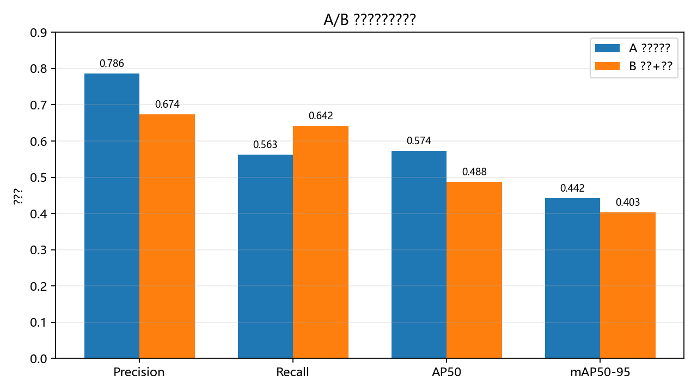
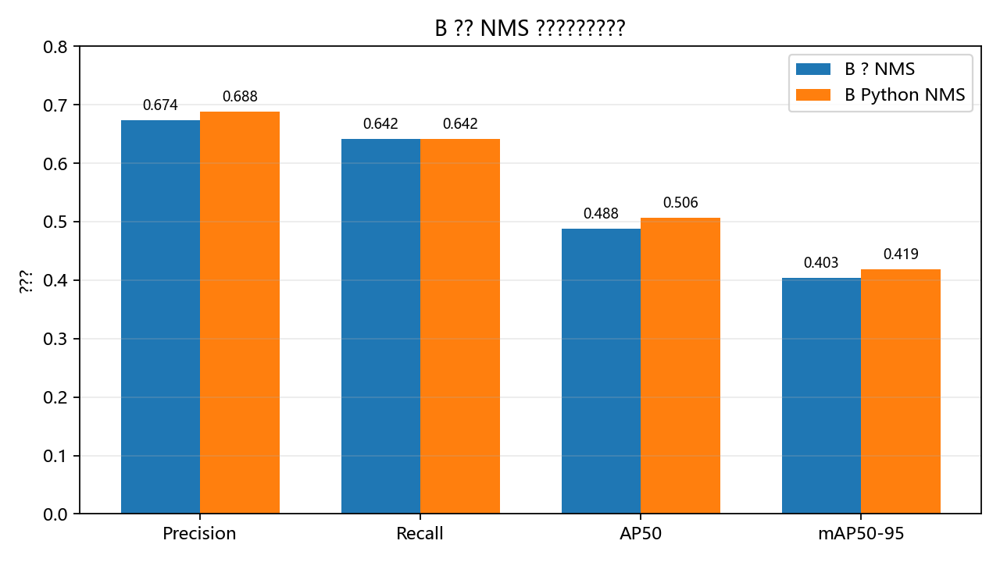
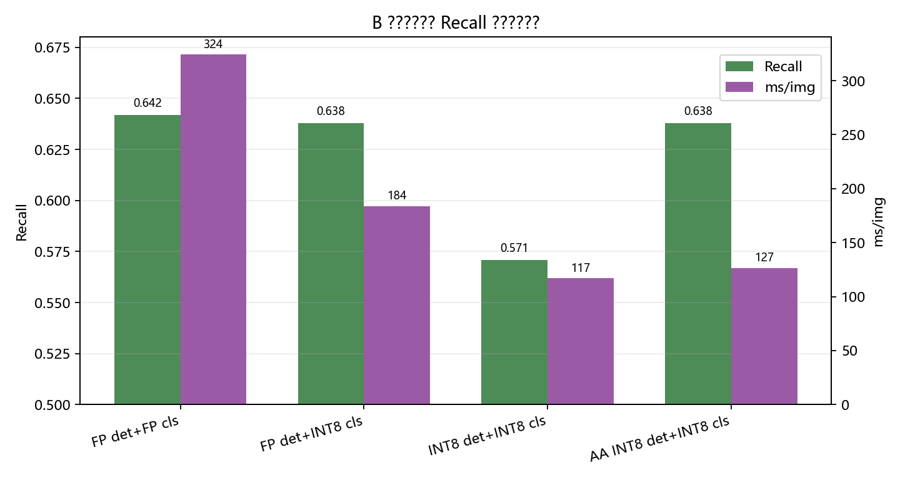
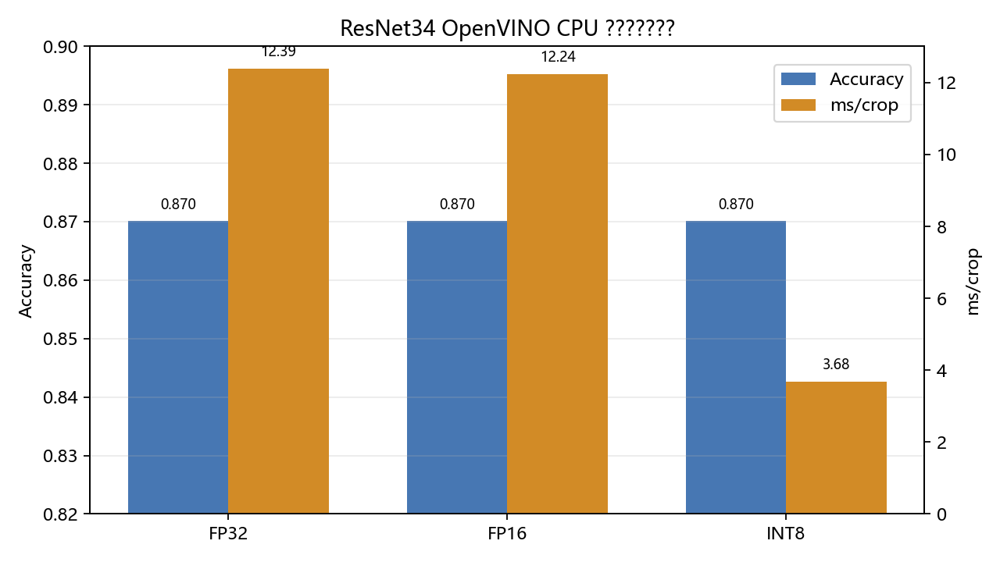

# 最终技术路线与实验归档

## 结论

截至 2026-06-01，项目主线收敛为 **B 方案：单类别 YOLO26s 检出 + ResNet34 多分类级联**。

部署精度策略固定为：

- YOLO26s 检测器：**不量化，保持 OpenVINO FP32**。
- 检测后处理：**模型内部 NMS**，输出形状为 `[1, num_selected, 6]`，C# 侧不再实现额外 NMS。
- ResNet34 分类器：**OpenVINO INT8 PTQ**。
- 部署后端：**OpenVINO CPU**。
- ONNX：只作为导出中间产物，不作为最终运行后端。

最终路线选择 B 方案的主要原因是验证集 recall 更高，符合当前小目标花粉场景下“先尽量检出，再做类别判别”的落地目标。A 方案作为历史对比保留在归档文档中，不再作为当前主流程推荐路线。


## A/B 路线对比



| 路线 | Precision | Recall | AP50 | mAP50-95 | 结论 |
| --- | ---: | ---: | ---: | ---: | --- |
| A 多类别 YOLO26s 检测 | 0.7857 | 0.5630 | 0.5735 | 0.4420 | precision 和 AP 更高，但漏检更多 |
| B 单类别检出 + 分类级联 | 0.6736 | 0.6417 | 0.4880 | 0.4034 | recall 更高，作为当前落地主线 |

数据来源：`C:\Users\liwei_niu\Downloads\runs_analysis\runs\compare_eval\...`。

## NMS 实验

前期发现 YOLO26s 输出中存在一批高度重叠框，B 方案同一目标可能出现几乎重合的重复预测。加入 NMS 后，B 方案在 recall 不变的情况下减少 FP，并提升 AP。



| 方案 | 预测框 | TP | FP | FN | Precision | Recall | AP50 | mAP50-95 |
| --- | ---: | ---: | ---: | ---: | ---: | ---: | ---: | ---: |
| B pipeline 无 NMS | 242 | 163 | 79 | 91 | 0.6736 | 0.6417 | 0.4880 | 0.4034 |
| B pipeline Python NMS | 237 | 163 | 74 | 91 | 0.6878 | 0.6417 | 0.5062 | 0.4189 |

工程结论：部署模型应把 NMS 固化在检测器 OpenVINO 图内部，C# 调用方只消费 `[x1, y1, x2, y2, score, class_id]` 风格输出，不再维护独立 NMS 算法分支。

## YOLO26s 精度路线

OpenVINO CPU 上，YOLO26s FP16 对 FP32 只有很小速度收益；INT8 虽然速度更快，但 recall 明显下降。即使使用 recall 约束的 accuracy-aware PTQ，也仍带来 AP 损失。因此最终不量化检测器。

| 检测器方案 | Detector Recall | 链路 Recall | Precision | AP50 | mAP50-95 | 总耗时 ms/img | 检测 ms/img |
| --- | ---: | ---: | ---: | ---: | ---: | ---: | ---: |
| FP detector + FP classifier | 0.6969 | 0.6417 | 0.6878 | 0.5054 | 0.4281 | 324.15 | 114.80 |
| FP detector + INT8 classifier | 0.6969 | 0.6378 | 0.6835 | 0.4953 | 0.4173 | 183.92 | 112.22 |
| 普通 INT8 detector + INT8 classifier | 0.6220 | 0.5709 | 0.6971 | 0.4378 | 0.3694 | 117.19 | 54.38 |
| Recall 感知 INT8 detector + INT8 classifier | 0.6890 | 0.6378 | 0.6778 | 0.4689 | 0.3925 | 126.58 | 55.83 |



另一次 YOLO26s FP32/FP16 检测器对比：

| 检测器 | Precision | Recall | AP50 | mAP50-95 | ms/img |
| --- | ---: | ---: | ---: | ---: | ---: |
| OpenVINO FP32 | 0.7468 | 0.6969 | 0.7399 | 0.6103 | 106.76 |
| OpenVINO FP16 | 0.7468 | 0.6969 | 0.7402 | 0.6107 | 103.11 |

FP16 只快约 3.4%，不值得为了这个收益改变最终交付口径。检测器最终保持 FP32。

## ResNet34 量化路线

ResNet34 是 B 链路主要耗时来源之一，INT8 PTQ 在 OpenVINO CPU 上收益明确，且分类 accuracy 不下降。



| 分类器 | Accuracy | Macro F1 | ms/crop | ms/img 分类阶段 |
| --- | ---: | ---: | ---: | ---: |
| OpenVINO FP32 | 0.8701 | 0.6677 | 12.39 | - |
| OpenVINO FP16 | 0.8701 | 0.6677 | 12.24 | 197.55 |
| OpenVINO INT8 PTQ | 0.8701 | 0.6932 | 3.68 | 58.42 |

链路对比：

| 链路 | Precision | Recall | AP50 | mAP50-95 | 总耗时 ms/img | 分类 ms/img |
| --- | ---: | ---: | ---: | ---: | ---: | ---: |
| FP detector + FP classifier | 0.6878 | 0.6417 | 0.5054 | 0.4281 | 325.89 | 197.55 |
| FP detector + INT8 classifier | 0.6835 | 0.6378 | 0.4953 | 0.4173 | 185.66 | 58.42 |

INT4 探测结果：当前 NNCF/OpenVINO CPU 路线没有落成真正的 4bit 执行收益，实际更像权重压缩/回退路径，速度接近 FP16，远慢于 INT8。因此不纳入主流程。

| 分类器尝试 | Accuracy | Macro F1 | ms/crop |
| --- | ---: | ---: | ---: |
| FP16 compressed | 0.8701 | 0.6677 | 14.03 |
| INT8 PTQ | 0.8701 | 0.6932 | 3.76 |
| INT4 asym default | 0.8701 | 0.6702 | 12.37 |
| INT4 asym all ratio 1 | 0.8701 | 0.6702 | 13.13 |
| INT4 sym all ratio 1 | 0.8701 | 0.6702 | 12.38 |

## 当前工程入口

训练阶段：

```bash
bash scripts/10_train_detector_single_prod.sh
CROP_RUN=<crop_run_id> bash scripts/12_train_classifier.sh
```

导出与量化阶段：

```powershell
# 检测器：默认 FP32
$env:TASK="detector"
$env:WEIGHTS="runs\detector\<run>\weights\best.pt"
$env:CLASS_MODE="single"
$env:IMGSZ="960"
$env:OUTPUT_DIR="runs\export_openvino\detector_yolo26s_fp32_nms"
.\scripts\30_export_openvino.ps1

# 分类器：先导出 OpenVINO 中间模型
$env:TASK="classifier"
$env:WEIGHTS="runs\classifier\<run>\weights\best.pt"
$env:OUTPUT_DIR="runs\export_openvino\classifier_resnet34_fp"
.\scripts\30_export_openvino.ps1

# 分类器：INT8 PTQ
$env:MODEL_XML="runs\export_openvino\classifier_resnet34_fp\model.xml"
$env:OUTPUT_DIR="runs\export_openvino\classifier_resnet34_int8"
.\scripts\32_quantize_classifier_int8.ps1
```

评估与可视化阶段仍使用：

```bash
DETECTOR_WEIGHTS=runs/detector/<run>/weights/best.pt \
CLASSIFIER_WEIGHTS=runs/classifier/<run>/weights/best.pt \
bash scripts/22_eval_pipeline.sh

DETECTOR_WEIGHTS=runs/detector/<run>/weights/best.pt \
CLASSIFIER_WEIGHTS=runs/classifier/<run>/weights/best.pt \
bash scripts/23_visualize_pipeline.sh
```

## 归档策略

以下内容属于历史实验或临时验证，不再作为主流程推荐入口：

- A 多类别检测对比实验入口。
- 一键训练完整 A/B 对比的 GPU 临时脚本。
- YOLO26s INT8、accuracy-aware INT8、ResNet34 INT4 等探索性量化脚本。
- 仅为实验分析服务的临时 benchmark 代码。

这些内容应保留在 `archive/2026-06-01-final-route-retired-experiments/`，文档只引用结论和关键数字，不把它们继续放在主流程 `scripts/` 入口中。
